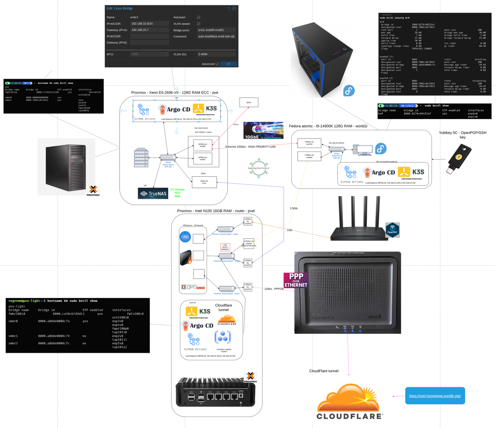

> 🚧 **Work in Progress**  
> This project is currently under active development.  
> Features, structure, and documentation may change frequently.  


# 🏗️ Home-Lab Architecture


# Jupyter/Zeppelin notebooks
To view the Jupyter notebooks, use the [Jetbrains Big Data Tools](https://www.jetbrains.com/help/idea/jupyter-notebook-support.html),  [GitHub viewer](notebooks/jupyter/quick-start/ScalaHelloWorld.ipynb), or run the container:
```shell
docker run -it -p 6660:8888 -v "${PWD}/notebooks/jupyter":/home/jovyan jupyter/pyspark-notebook start.sh jupyter notebook --NotebookApp.token=''
```

  * http://localhost:6660

# Development Containers
- https://devpod.sh/
  - 

```shell
devpod up . --ide none
```


# Links
- https://pvel-homepage.worldb.site/


