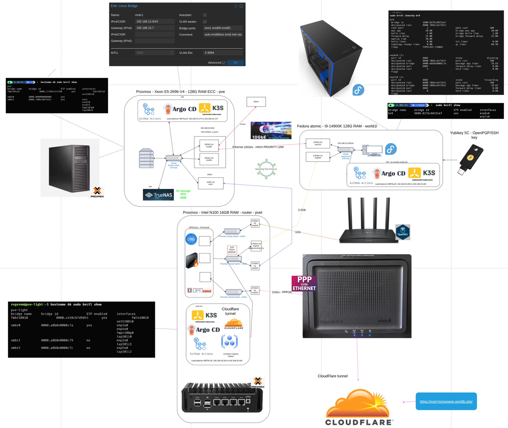
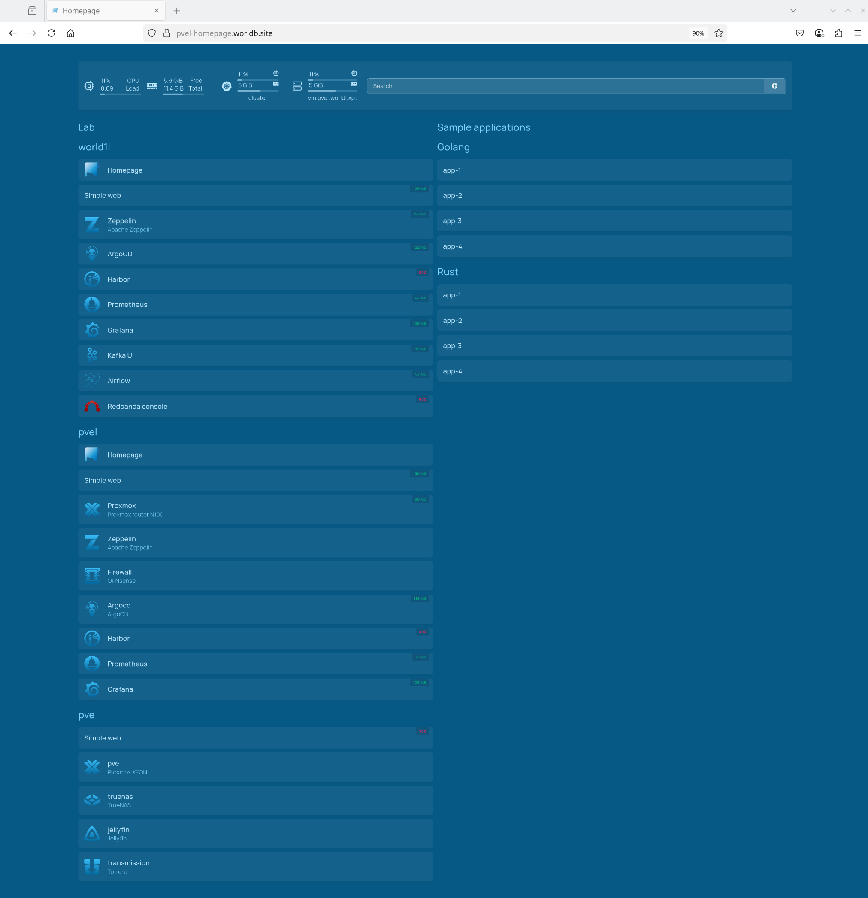

> 🚧 **Work in Progress**  
> This project is currently under active development.  
> Features, structure, and documentation may change frequently.

# Sections
 - [`Development containers`](docs/devcontainers/README.md)
 - [`On-Premisse Infrasture`](docs/on-premisses-infrastructure/README.md)
 - [`Databricks Cloud Infrastructure`](docs/cloud-databricks-infrastructure/aws/README.md)  
 - [`Databricks/AWS Cloud & On-Premise integration`](docs/cloud-integration/README.md)
 - [`AWS Cloud Infrastructure`](docs/cloud-infrastructure/README.md)

# 🏗️ Homelab On-Premise Architecture

# Links
- https://pvel-homepage.worldb.site/

