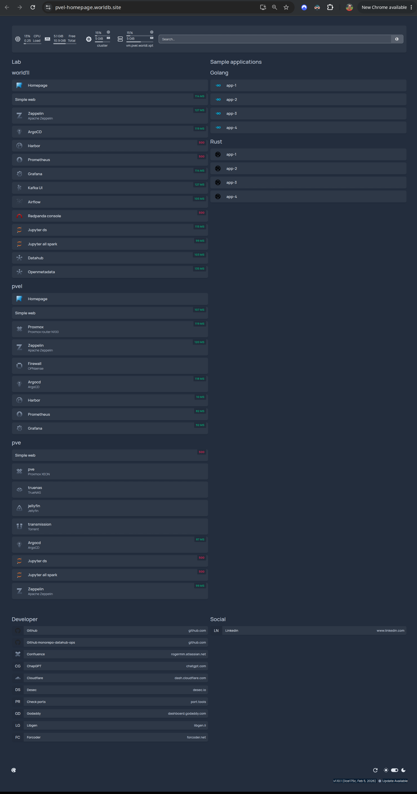

# DataHub Ops Infrastructure

> 🚧 **Work in progress**
>
> This project is currently under active development. Features, structure, and
> documentation may change frequently.

> **Documentation**
>
> This repository's documentation is written using
> [Obsidian](https://obsidian.md/). Some files may contain Obsidian-specific
> Markdown syntax.

### Documentation file names

Document files under `docs/` use spaces between words and start with an
uppercase letter. Image and diagram assets use kebab-case. See
[Documentation conventions](docs/Documents%20Conventions.md) for details.

## Documentation Sections

- [Development containers](docs/devcontainers/Development%20Containers.md)
- [On-premises infrastructure](docs/on-premises-infrastructure/On%20Premises%20Infrastructure.md)
- [Databricks Cloud Infrastructure Premium](docs/cloud-databricks-infrastructure/aws/Cloud%20Databricks%20Infrastructure%20AWS.md)
- [Databricks Cloud Infrastructure Free Edition](docs/cloud-databricks-infrastructure/free/Cloud%20Databricks%20Infrastructure%20Free.md)
- [Databricks, AWS, and on-premises integration](docs/cloud-integration/Cloud%20Integration.md)
- [AWS Cloud Infrastructure](docs/cloud-infrastructure/Cloud%20Infrastructure.md)
- [Notebooks](docs/notebooks/Notebooks.md)
- [JetBrains](docs/jetbrains/JetBrains.md)
- [Documentation conventions](docs/Documents%20Conventions.md)

## 🏗️ Home Lab On-Premises Architecture

Host pvel-vm, Kubernetes pods:

## Links

- [Home lab homepage](https://pvel-homepage.worldb.site/)
	- Cloudflare Tunnel with Google authentication and country-based access restrictions.

