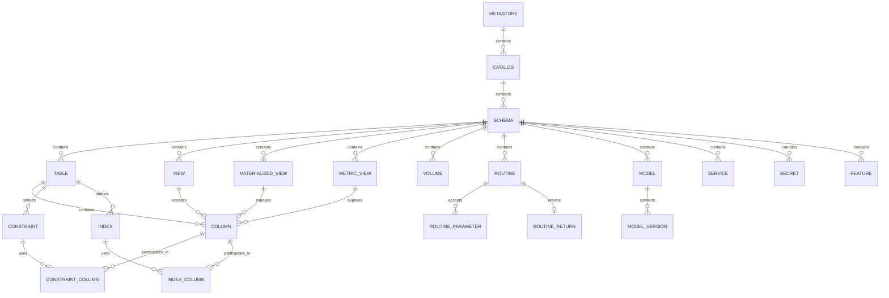
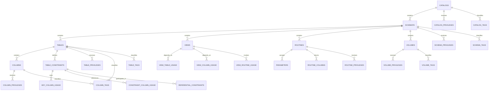
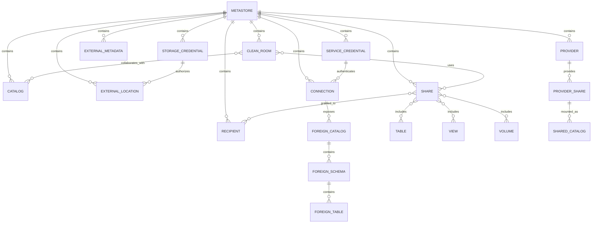
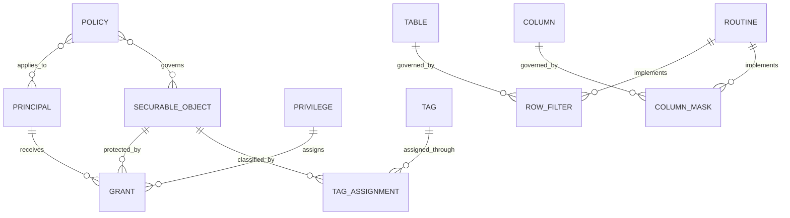
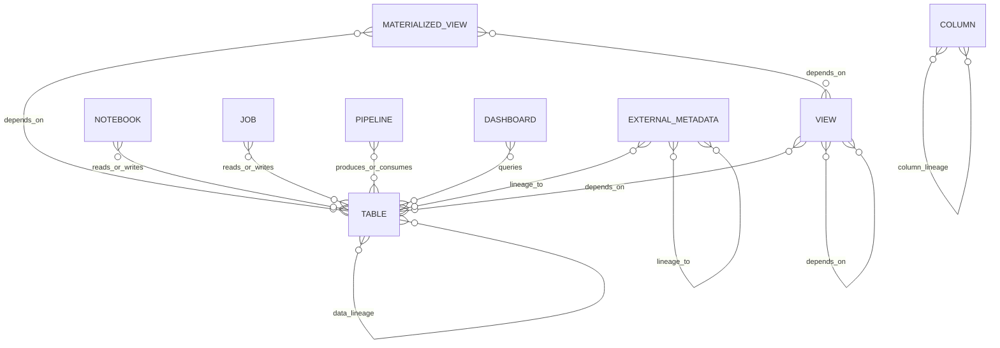

# Databricks Unity Catalog — Entity Relationship Model

## Core object hierarchy



## Information Schema entities



## Simplified logical hierarchy

```text
Metastore
└── Catalog
    └── Schema
        ├── Table
        │   ├── Column
        │   ├── Constraint
        │   ├── Tag
        │   └── Privilege
        │
        ├── View
        │   ├── Column
        │   ├── Table dependency
        │   ├── Column dependency
        │   ├── Routine dependency
        │   ├── Tag
        │   └── Privilege
        │
        ├── Materialized view
        ├── Metric view
        │
        ├── Routine
        │   ├── Parameter
        │   ├── Return column
        │   ├── Tag
        │   └── Privilege
        │
        ├── Volume
        │   ├── Tag
        │   └── Privilege
        │
        ├── Model
        │   └── Model version
        │
        ├── Service
        ├── Secret
        └── Feature
```

## Metastore-level entities



## Governance relationships



## Data lineage relationships



# SQL metadata queries

## Catalogs

```sql
SELECT *
FROM system.information_schema.catalogs;
```

## Schemas

```sql
SELECT *
FROM system.information_schema.schemata;
```

## Tables and views

The `TABLES` relation contains tables, views, materialized views, streaming tables and other relation types.

```sql
SELECT *
FROM system.information_schema.tables;
```

## Columns

```sql
SELECT *
FROM system.information_schema.columns;
```

## Views

```sql
SELECT *
FROM system.information_schema.views;
```

## Volumes

```sql
SELECT *
FROM system.information_schema.volumes;
```

## Routines

```sql
SELECT *
FROM system.information_schema.routines;
```

## Routine parameters

```sql
SELECT *
FROM system.information_schema.parameters;
```

## Routine return columns

```sql
SELECT *
FROM system.information_schema.routine_columns;
```

## Table constraints

```sql
SELECT *
FROM system.information_schema.table_constraints;
```

## Constraint columns

```sql
SELECT *
FROM system.information_schema.key_column_usage;
```

## Foreign-key relationships

```sql
SELECT *
FROM system.information_schema.referential_constraints;
```

## View-to-table dependencies

```sql
SELECT *
FROM system.information_schema.view_table_usage;
```

## View-to-column dependencies

```sql
SELECT *
FROM system.information_schema.view_column_usage;
```

## View-to-routine dependencies

```sql
SELECT *
FROM system.information_schema.view_routine_usage;
```

## Catalog privileges

```sql
SELECT *
FROM system.information_schema.catalog_privileges;
```

## Schema privileges

```sql
SELECT *
FROM system.information_schema.schema_privileges;
```

## Table privileges

```sql
SELECT *
FROM system.information_schema.table_privileges;
```

## Column privileges

```sql
SELECT *
FROM system.information_schema.column_privileges;
```

## Routine privileges

```sql
SELECT *
FROM system.information_schema.routine_privileges;
```

## Volume privileges

```sql
SELECT *
FROM system.information_schema.volume_privileges;
```

## Catalog tags

```sql
SELECT *
FROM system.information_schema.catalog_tags;
```

## Schema tags

```sql
SELECT *
FROM system.information_schema.schema_tags;
```

## Table tags

```sql
SELECT *
FROM system.information_schema.table_tags;
```

## Column tags

```sql
SELECT *
FROM system.information_schema.column_tags;
```

## Volume tags

```sql
SELECT *
FROM system.information_schema.volume_tags;
```

# Query to enumerate available Information Schema entities

This query lists the metadata views that are actually available in your Databricks environment:

```sql
SELECT
    table_name AS entity_name
FROM system.information_schema.tables
WHERE table_catalog = 'system'
  AND table_schema = 'information_schema'
ORDER BY table_name;
```

# Query to generate the Catalog → Schema → Relation hierarchy

```sql
SELECT
    c.catalog_name,
    s.schema_name,
    t.table_name,
    t.table_type
FROM system.information_schema.catalogs AS c
LEFT JOIN system.information_schema.schemata AS s
    ON c.catalog_name = s.catalog_name
LEFT JOIN system.information_schema.tables AS t
    ON s.catalog_name = t.table_catalog
   AND s.schema_name = t.table_schema
ORDER BY
    c.catalog_name,
    s.schema_name,
    t.table_name;
```

# Query to extract declared foreign-key relationships

```sql
SELECT
    fk.constraint_catalog,
    fk.constraint_schema,
    fk.constraint_name,

    fk.table_catalog AS child_catalog,
    fk.table_schema AS child_schema,
    fk.table_name AS child_table,

    pk.table_catalog AS parent_catalog,
    pk.table_schema AS parent_schema,
    pk.table_name AS parent_table

FROM system.information_schema.referential_constraints AS rc

JOIN system.information_schema.table_constraints AS fk
    ON rc.constraint_catalog = fk.constraint_catalog
   AND rc.constraint_schema = fk.constraint_schema
   AND rc.constraint_name = fk.constraint_name

JOIN system.information_schema.table_constraints AS pk
    ON rc.unique_constraint_catalog = pk.constraint_catalog
   AND rc.unique_constraint_schema = pk.constraint_schema
   AND rc.unique_constraint_name = pk.constraint_name

ORDER BY
    child_catalog,
    child_schema,
    child_table,
    parent_catalog,
    parent_schema,
    parent_table;
```

# Conceptual model

```text
Principal
    │
    └── receives Privilege
            │
            └── on Securable Object

Securable Object
    ├── Metastore
    ├── Catalog
    ├── Schema
    ├── Table
    ├── View
    ├── Volume
    ├── Routine
    ├── Model
    ├── Service
    ├── Secret
    ├── Feature
    ├── Storage Credential
    ├── Service Credential
    ├── External Location
    ├── Connection
    ├── Share
    ├── Provider
    ├── Recipient
    ├── Clean Room
    └── External Metadata
```
# See also
 - [[unity-catalog.ipynb]]