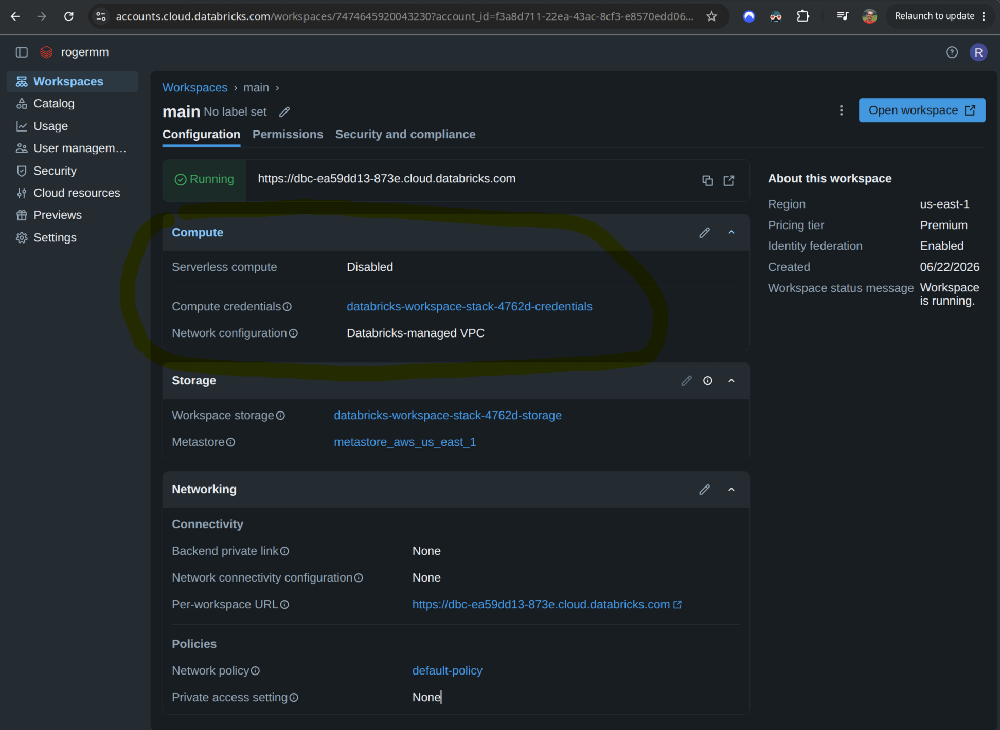
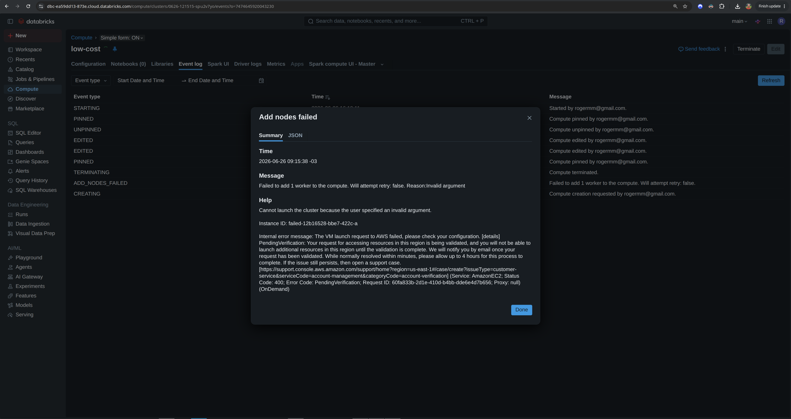
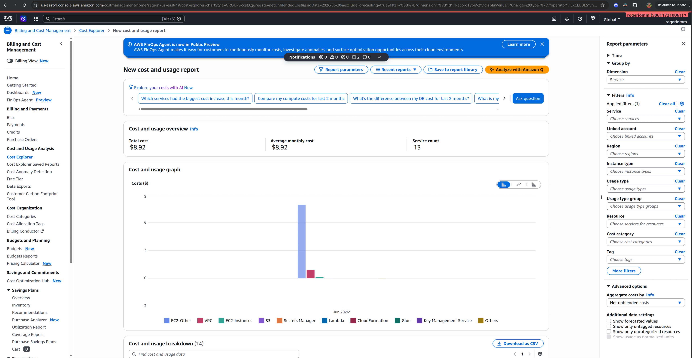
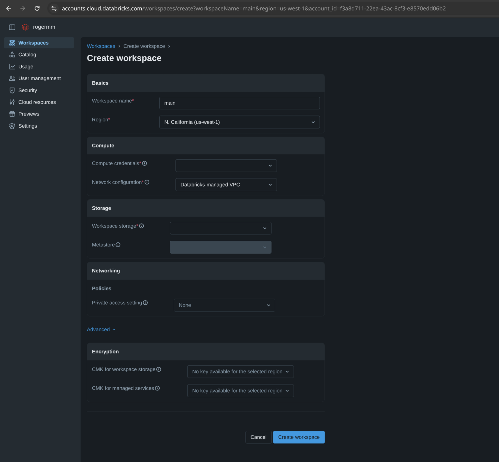

# Install
- CloudFormation provided by Databricks: [`AWS Cloudformation yaml`](attachments/aws-create-stack-databricks.yaml)
    - https://dbricks.co/AWSQuickStartHelp

AWS CloudFormation
Databricks managed VPC


Finish the setup on the AWS


Workspace created


Databricks managed VPC




- [Manage your subscription and billing](https://docs.databricks.com/aws/en/admin/account-settings/account)

Workspace create without payment methods

 

Add compute without credit card



Adding credit card


Selecting the Free Personal account and work account


# Create a personal Databricks compute
```shell
databricks clusters list
```

```shell
databricks ssh setup --name low-cost --cluster 0626-121515-spu2v7yo  --auto-start-cluster=false
```

# Initial FinOps


-  https://us-east-1.console.aws.amazon.com/costmanagement/home#/credits
# Delete the AWS Cloud Formation resources

![[AwsCloudFormationDeleteDatabricks.png]]

Databricks after AWS Cloud Formation stack deletion
![[DatabricksAfterCloudFormationDeleteStack.png]]

# Change the Databricks managed VPC to a customer-manage VPC
 - https://github.com/databricks/terraform-provider-databricks/blob/main/docs/guides/aws-workspace.md
 - [Customer managed VPC](https://docs.databricks.com/aws/en/security/network/classic/customer-managed-vpc) &longrightarrow; [Sample VPC](https://github.com/rogeriomm/databricks-platform-infra/blob/a5a32e73dd2df790c2d762ad7f70caa61048cab2/vpc.tf#L1)
	 - [Security groups](https://docs.databricks.com/aws/en/security/network/classic/customer-managed-vpc#security-groups) &longrightarrow; [Sample Security Group](https://github.com/rogeriomm/databricks-platform-infra/blob/a5a32e73dd2df790c2d762ad7f70caa61048cab2/vpc.tf#L109)


Delete the workspace and create a new one:

Old:

New:


# Links
- https://github.com/leorickli/databricks-platform-infra
	- https://github.com/leorickli/databricks-platform-data