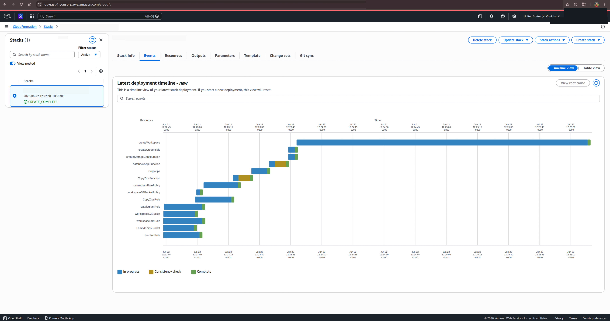
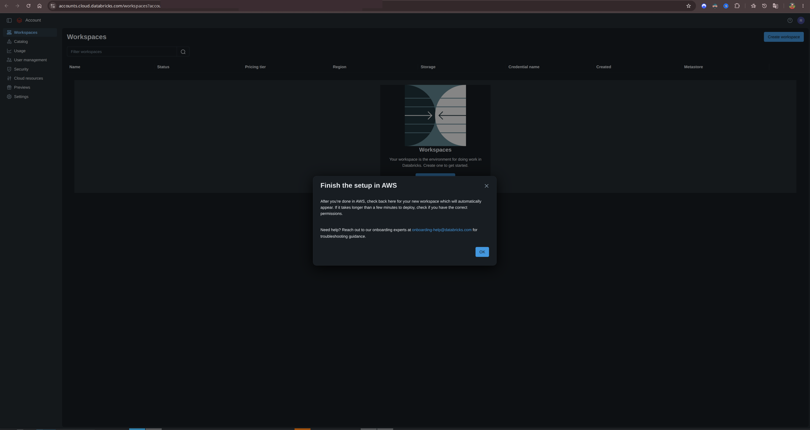
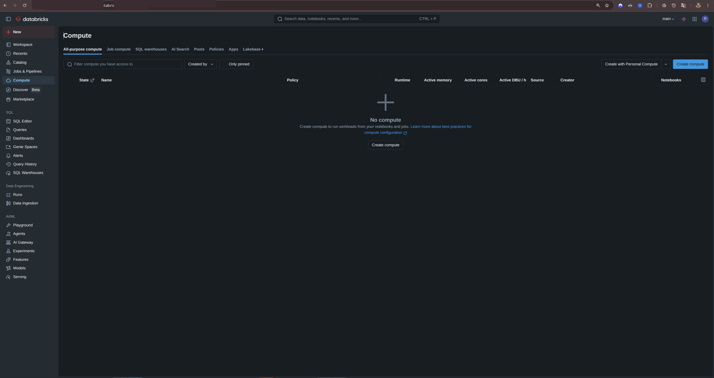
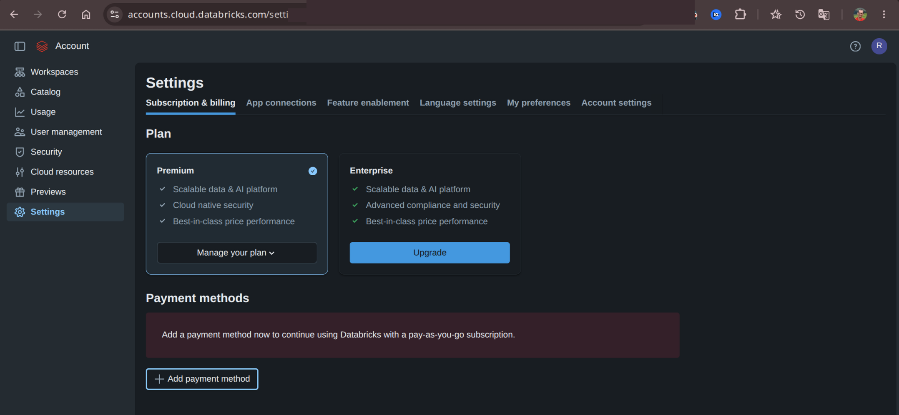
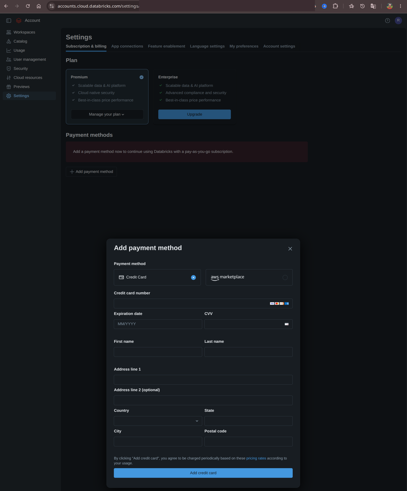
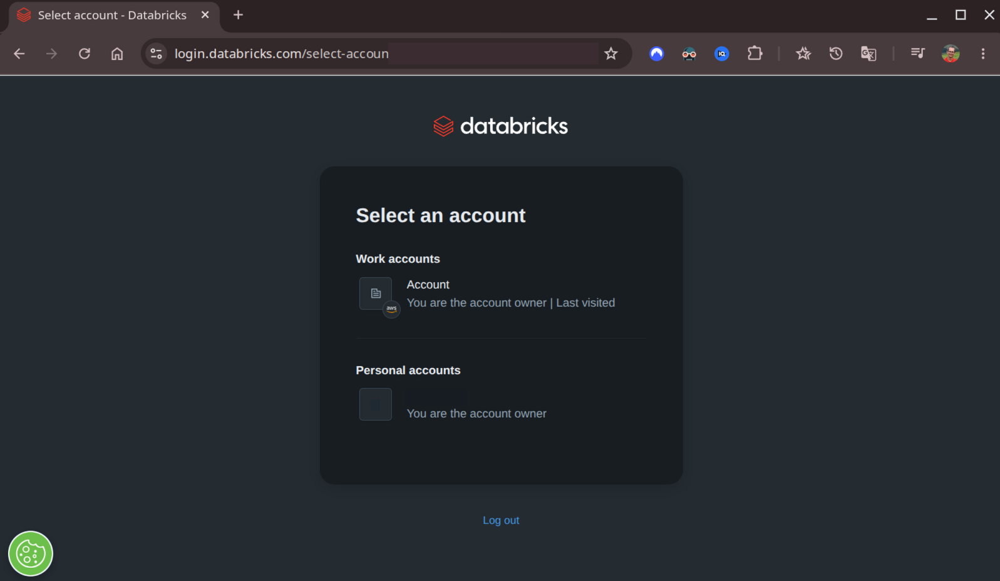

- [`AWS Cloudformation yaml`](attachments/aws-create-stack-databricks.yaml)
    - https://dbricks.co/AWSQuickStartHelp

- [Manage your subscription and billing](https://docs.databricks.com/aws/en/admin/account-settings/account)

