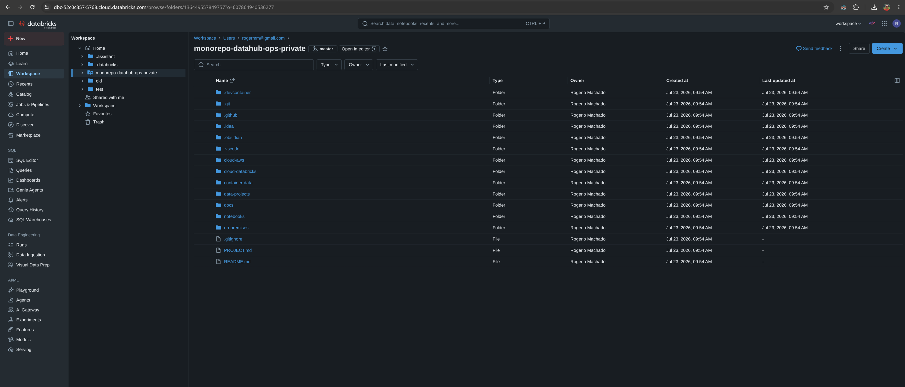
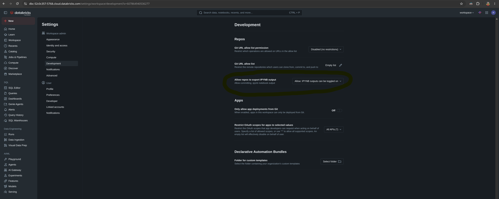
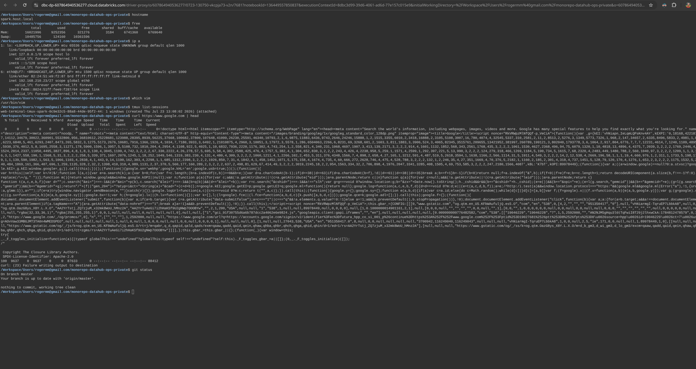
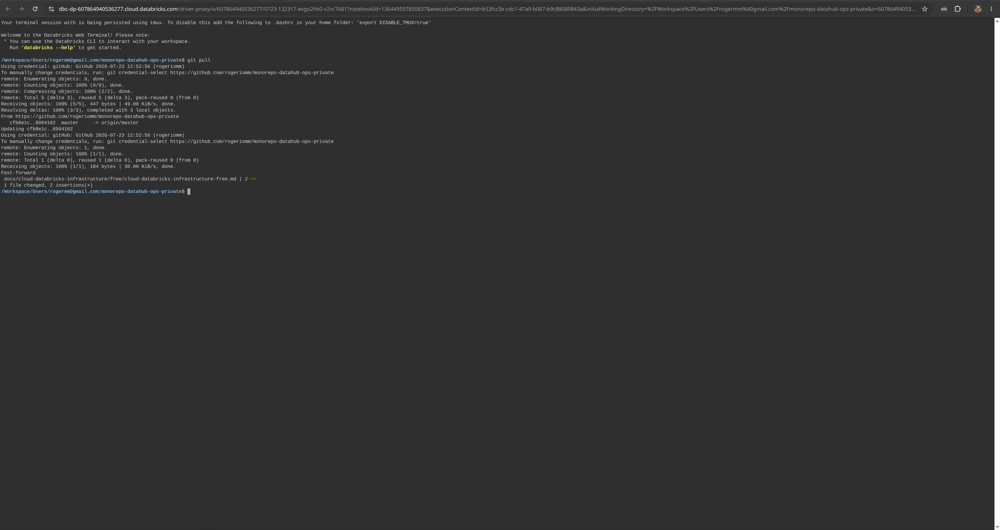
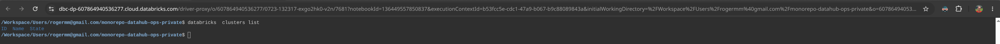
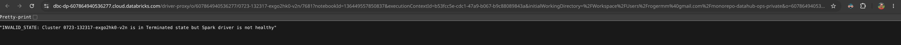
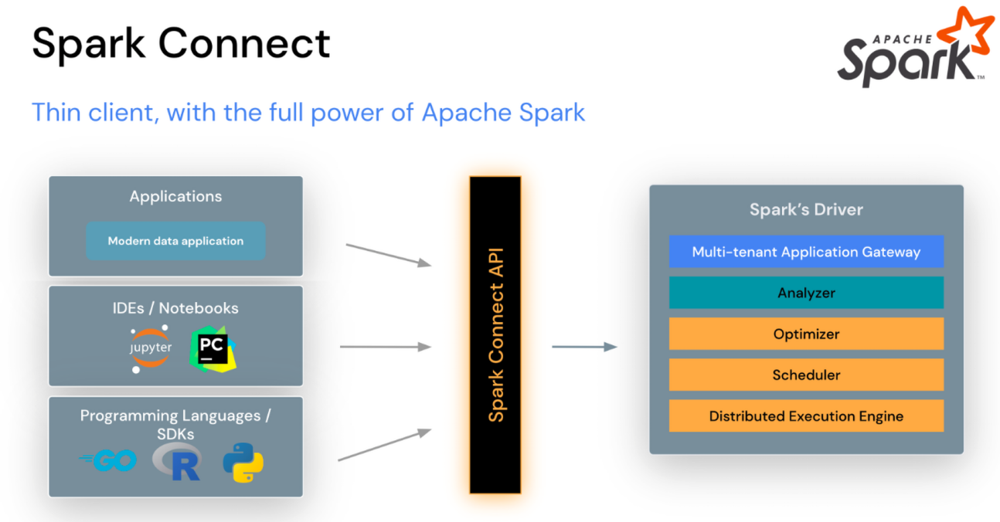
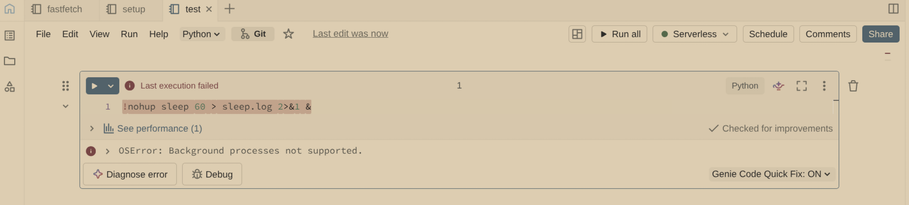
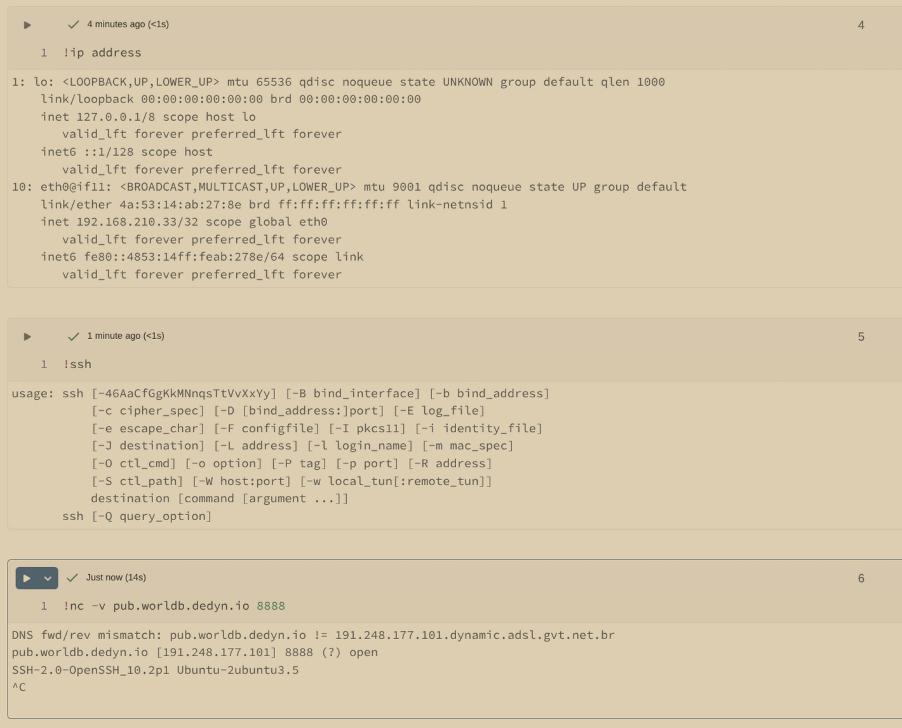

# Databricks Free Edition Infrastructure

## Databricks Git Folder



## Git Web Terminal

- Uses [tmux](https://github.com/tmux/tmux/wiki).
- Includes Vim, Git, and the Databricks CLI.
- Runs on an ARM processor.











```shell
tmux show-options -g prefix
tmux list-keys | grep window
```

- Enable **Allow repos to export IPYNB output**.


## Databricks Free Edition Internals

### Serverless Environment Versions

- [Serverless environment versions](https://docs.databricks.com/aws/en/release-notes/serverless/environment-version)
- [Databricks Connect](https://docs.databricks.com/aws/en/dev-tools/databricks-connect/)
- [Spark Connect overview](https://spark.apache.org/docs/latest/spark-connect-overview.html)



## Running Background Processes



## Network



[Databricks CLI sample notebook](../../../notebooks/jupyter/databricks/free-edition/databricks-cli-hello-world.ipynb)
