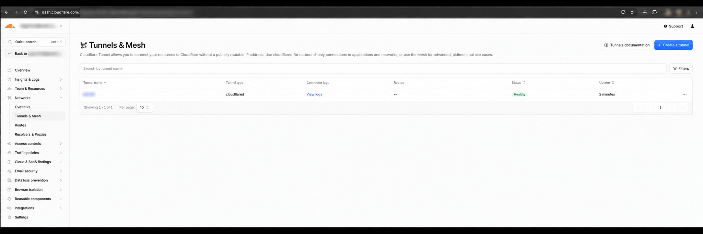
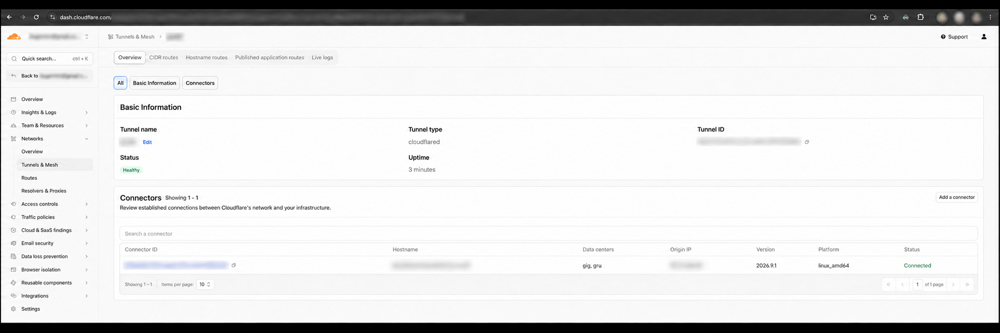
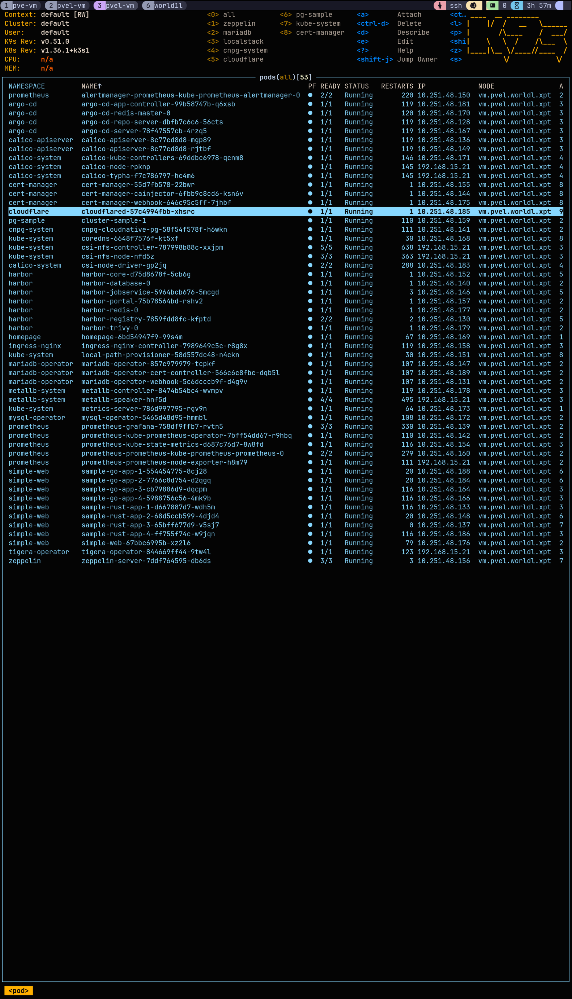

# My Cloudflare infrastructure

The Cloudflare dashboard provides health and configuration details for managed
tunnels, connectors, and published applications.

## Tunnel overview

### Tunnel status

The tunnel list shows the connector type, route count, current status, and
uptime.



### Tunnel and connector details

The tunnel details page shows its status and active connector. Identifiers,
hostnames, account information, and origin addresses are intentionally blurred.



Published applications are configured under **Cloudflare Dashboard →
Networking → Tunnels → select the tunnel → Routes → Add route →
Published application**.

## Cloudflare Origin CA certificate and private key

Follow the [Cloudflare Origin CA
instructions](https://developers.cloudflare.com/ssl/origin-configuration/origin-ca/):

1. Open the Cloudflare dashboard and select the `worldb.site` zone.
2. Go to **SSL/TLS → Origin Server** and select **Create Certificate**.
3. Add `*.worldb.site` and any other required hostnames.
4. Choose PEM format.
5. Save the Origin Certificate and Private Key as separate files outside this
   repository. Cloudflare does not display the private key again after leaving
   the creation screen.


### Traefik custom TLS configuration

Set the absolute certificate and private-key paths in
`on-premises/docker/.env`:

```dotenv
TRAEFIK_CUSTOM_TLS_CERT_FILE=/absolute/path/to/cloudflare-origin-ca.pem
TRAEFIK_CUSTOM_TLS_KEY_FILE=/absolute/path/to/cloudflare-origin-ca.key
```

From the repository root, start or recreate Traefik with the optional custom
TLS override:

```shell
docker compose \
  -f on-premises/docker/docker-compose.yaml \
  -f on-premises/docker/compose-traefik-custom-tls.yaml \
  up -d --force-recreate traefik
```

Traefik selects the certificate by TLS Server Name Indication (SNI). The
certificate Subject Alternative Names must therefore cover the SNI hostname
that `cloudflared` sends to the `websecure` entrypoint.

## Published application TLS settings


For a published application such as `orange-pgadmin.worldb.site`, configure its
TLS settings as follows:

- Keep **Disable TLS certificate verification** disabled.
- Enable **Match SNI to host**.
- Leave **Origin Server Name** empty.
- Leave **CA Pool** empty when using a Cloudflare Origin CA certificate.


With **Match SNI to host** enabled, `cloudflared` uses the incoming public
hostname, such as `orange-pgadmin.worldb.site`, as SNI. This matches the
`*.worldb.site` certificate and allows Traefik to present the custom
certificate.

If SNI matching is disabled, `cloudflared` uses the hostname from the service
URL, such as `pgadmin.ing.orange.worldl.xpt`. That hostname is not covered by
`*.worldb.site`, so Traefik presents its generated default certificate and
certificate verification fails.

As an alternative to **Match SNI to host**, set **Origin Server Name** to the
public hostname covered by the certificate. Do not configure both because SNI
matching overrides the explicit origin server name. See the [Cloudflare Tunnel
origin parameters](https://developers.cloudflare.com/cloudflare-one/networks/connectors/cloudflare-tunnel/configure-tunnels/origin-parameters/)
reference for details.

Set the Cloudflare zone SSL/TLS encryption mode to **Full (strict)**. Cloudflare
Origin CA certificates are intended for proxied origin traffic and are not
trusted directly by normal browsers.

## Debugging

Use K9s on `pvel-vm` to inspect the connector pod:



Follow the `cloudflared` connector logs while reproducing a request:

```shell
kubectl logs -n cloudflare deployment/cloudflared --follow
```

An SNI mismatch produces an error similar to:

```text
tls: failed to verify certificate: x509: certificate is valid for <traefik-default-hostname>, not <service-url-hostname>
```

## Dashboard

- [Cloudflare dashboard](https://dash.cloudflare.com/)
