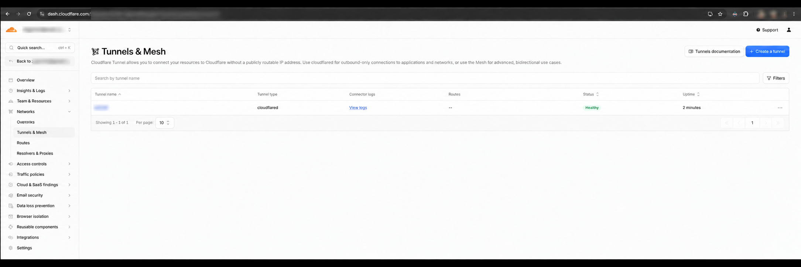
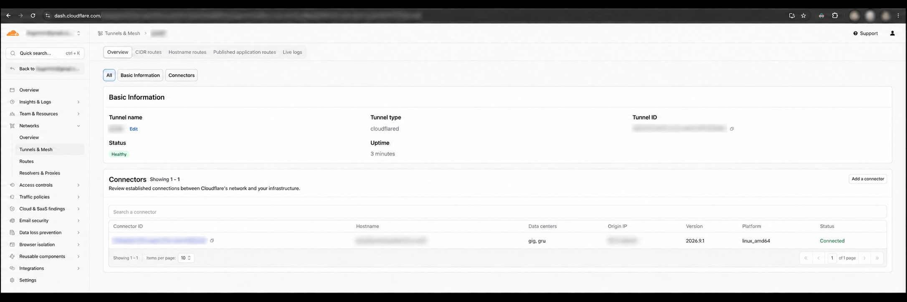

# Cloudflare Tunnel overview

The Cloudflare dashboard provides the health and configuration details for
managed tunnels and their connectors.

## Tunnel status

The tunnel list shows the connector type, route count, current status, and
uptime.

## Tunnel and connector details

The tunnel details page shows its status and the active connector. Identifiers,
hostnames, account information, and origin addresses are intentionally blurred.

**Cloudflare Dashboard → Networking → Tunnels → select your tunnel → Routes → Add route → Published application**.