# Development Containers

## Table of contents

- [Start a development container](#start-a-development-container)
  - [Using terminal](#using-terminal)
  - [Using Visual Studio Code](#using-visual-studio-code)
- [Docker](#docker)
- [Traefik reverse proxy](#traefik-reverse-proxy)
- [Jupyter notebooks](#jupyter-notebooks)
- [AWS CLI](#aws-cli)
- [Zeppelin notebooks](#zeppelin-notebooks)
- [Airflow](#airflow)
- [Superset](#superset)
- [Local S3 object store](#local-s3-object-store)
  - [Cleaning the S3 object store](#cleaning-the-s3-object-store)
- [PostgreSQL](#postgresql)
  - [Debugging](#debugging)
  - [Cleaning the database](#cleaning-the-database)
  - [Connect from the host](#connect-from-the-host)
  - [Connect from another container](#connect-from-another-container)
  - [Connect from the PostgreSQL container](#connect-from-the-postgresql-container)
  - [pgAdmin 4](#pgadmin-4)
- [Kafka](#kafka)
- [SSH tunnel](#ssh-tunnel)
- [AWS](#aws)
  - [CLI](#cli)
- [Databricks](#databricks)
  - [CLI](#cli-1)
- [Local services](#local-services)
- [References](#references)

## Start a development container

- [DevPod](https://devpod.sh/)

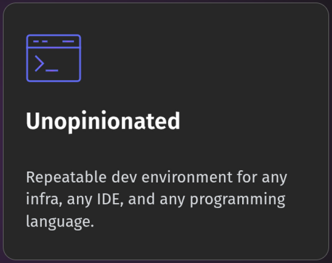

### Using terminal

```shell
devpod up . --ide none
```

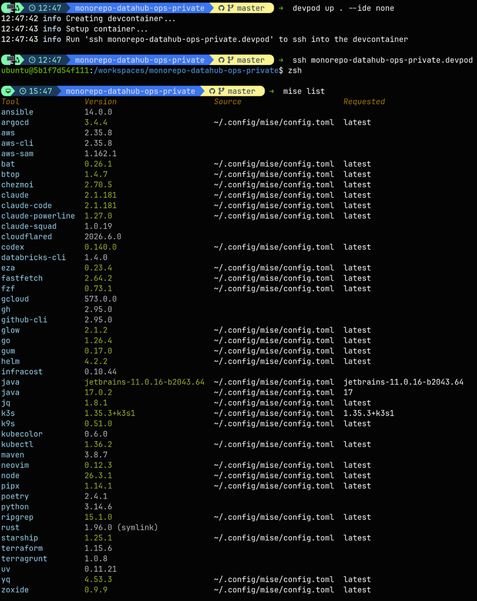

### Using Visual Studio Code

```shell
devpod up . --ide vscode
```

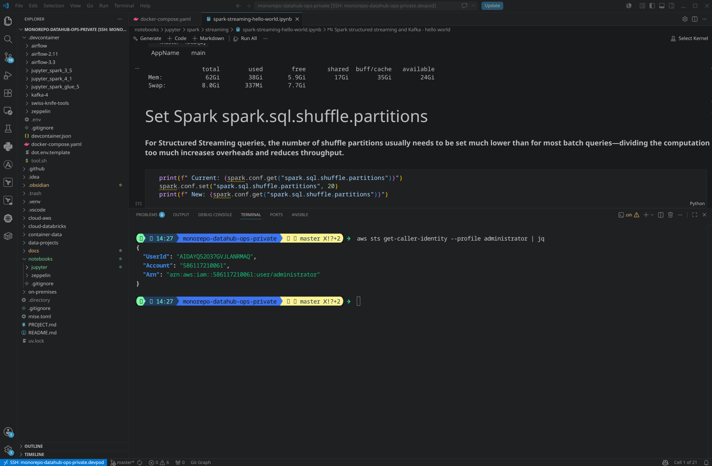

## Docker

The Docker socket is mounted inside the development container by the
repository's
[`docker-compose.yaml`](../../on-premises/docker/docker-compose.yaml):

```yaml
- /var/run/docker.sock:/var/run/docker.sock
```

This allows the development container to use the host's Docker Engine.

Verify access from inside the development container:

```shell
docker ps -a
```

## Traefik reverse proxy

Open the [Traefik dashboard](http://traefik.localhost:8080/dashboard/) to access the administration interface.

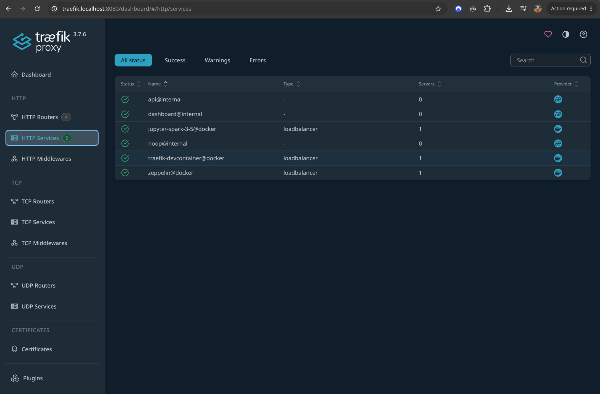

## Jupyter notebooks

See the [local services](#local-services) for the available Jupyter endpoints.

## AWS CLI

- [AWS CLI hello world notebook](../../notebooks/jupyter/aws/aws-cli-hello-world.ipynb)

## Zeppelin notebooks

## Airflow

Get the administrator password using the repository's
[`docker-compose.yaml`](../../on-premises/docker/docker-compose.yaml) file:

```shell
docker compose -f on-premises/docker/docker-compose.yaml exec airflow-3.3 \
  cat /opt/airflow/simple_auth_manager_passwords.json.generated
```

## Superset

Superset is defined in the repository's
[`docker-compose.yaml`](../../on-premises/docker/docker-compose.yaml) under the
`superset` profile. It initializes its metadata database in the persistent
`devcontainer_superset-data` volume.

> [!WARNING]
> The default administrator credentials are `admin` / `admin`. Set
> `SUPERSET_ADMIN_PASSWORD` and `SUPERSET_SECRET_KEY` in
> `on-premises/docker/.env` before using the service outside an isolated local
> environment.

Generate a secret key with:

```shell
openssl rand -base64 42
```

Start Superset and Traefik from the repository root:

```shell
docker compose -f on-premises/docker/docker-compose.yaml \
  --profile superset up -d traefik superset
```

Open [Superset](http://superset.localhost:8080/) in a browser. If
`TRAEFIK_HTTP_PORT` is configured, replace `8080` with that value.

## Local S3 object store

The direct SeaweedFS S3 endpoint requires TLS. Its development CA certificate
is generated at `on-premises/docker/seaweedfs/certificates/ca.crt` when the service
first starts.

Use the AWS CLI to connect directly:

```shell
export AWS_ACCESS_KEY_ID=admin AWS_SECRET_ACCESS_KEY=secret
export AWS_CA_BUNDLE=on-premises/docker/seaweedfs/certificates/ca.crt
export AWS_REGION=us-east-1
```

Create a bucket:

```shell
aws --endpoint-url https://localhost:8333 \
  s3 mb s3://my-bucket
```

Remove a bucket:

```shell
aws --endpoint-url https://localhost:8333 \
  s3 rm s3://my-bucket
```

List buckets:

```shell
aws --endpoint-url https://localhost:8333 s3 ls
```

Or connect through Traefik:

```shell
aws --endpoint-url http://seaweedfs-s3.localhost:8080 s3 ls
```

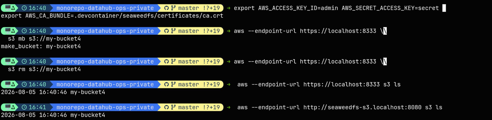

[S3 hello world notebook](../../notebooks/jupyter/s3/s3-hello-world.ipynb)

### Cleaning the S3 object store

```shell
docker volume rm devcontainer_seaweedfs-data
```

## PostgreSQL

PostgreSQL requires mutually authenticated TLS for all TCP connections. A local
CA signs the server and reusable client certificates. The client artifacts are
available under `on-premises/docker/postgres/certificates/` after the container
starts; the CA and server private keys remain inside the PostgreSQL data volume.

Set `POSTGRES_HOSTNAME` to the DNS name used by remote clients before starting
the service. The generated server certificate also includes `postgres`,
`localhost`, and `127.0.0.1` for local access.

The client certificate common name matches `POSTGRES_USER`. A PKCS12 copy named
`postgres-client.p12`, with alias `user`, is protected by
`POSTGRES_CLIENT_STORE_PASSWORD` for JDBC clients that require a keystore.

### Debugging

```shell
cd on-premises/docker
```

```shell
docker compose logs postgres -f
```

Example using Databricks Free Edition and on-premises public endpoint:

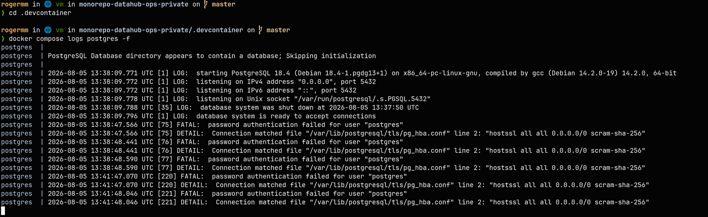

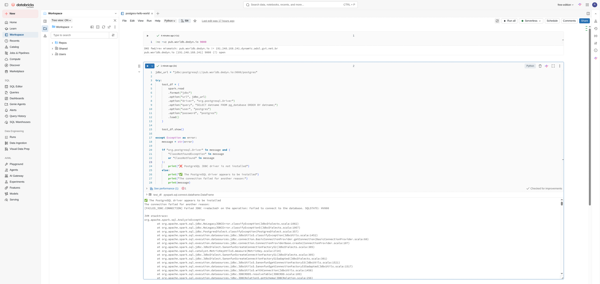

### Cleaning the database

```shell
docker volume rm devcontainer_postgres-data
```

### Connect from the host

Use the `POSTGRES_PORT` value configured for Docker Compose, or port `5432` by
default:

```shell
export PGPORT="${POSTGRES_PORT:-5432}"
export PGSSLMODE=verify-full
export PGSSLROOTCERT=on-premises/docker/postgres/certificates/ca.crt
export PGSSLCERT=on-premises/docker/postgres/certificates/client.crt
export PGSSLKEY=on-premises/docker/postgres/certificates/client.key
```

```shell
psql \
  --host=localhost \
  --port="$PGPORT" \
  --username=postgres \
  --dbname=postgres
```

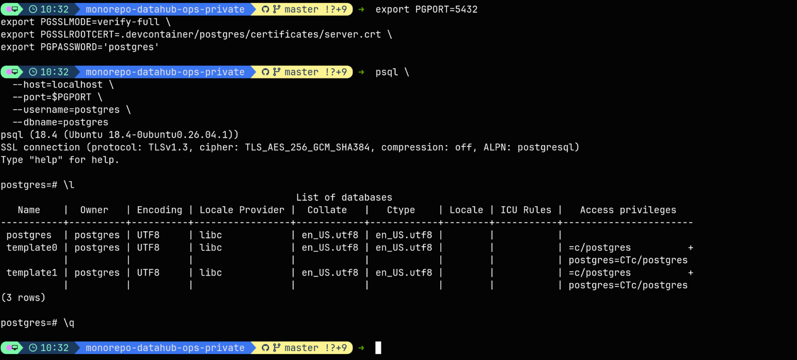

### Connect from another container

For example, connect from `jupyter-spark-4.1` using the Compose service name:

```shell
PGSSLMODE=verify-full \
PGSSLROOTCERT=/home/jovyan/work/on-premises/docker/postgres/certificates/ca.crt \
PGSSLCERT=/home/jovyan/work/on-premises/docker/postgres/certificates/client.crt \
PGSSLKEY=/home/jovyan/work/on-premises/docker/postgres/certificates/client.key \
psql \
  --host=postgres \
  --username=postgres \
  --dbname=postgres
```

### Connect from the PostgreSQL container

```shell
docker compose -f on-premises/docker/docker-compose.yaml exec postgres /bin/bash
```

Then switch to the `postgres` user and connect:

```shell
su - postgres
PGSSLMODE=verify-full \
PGSSLROOTCERT=/var/lib/postgresql/tls/ca.crt \
PGSSLCERT=/var/lib/postgresql/tls/client.crt \
PGSSLKEY=/var/lib/postgresql/tls/client.key \
psql \
  --host=localhost \
  --username=postgres \
  --dbname=postgres
```

- [PostgreSQL CLI hello world notebook](../../notebooks/jupyter/postgres/postgres-cli-hello-world.ipynb)

### pgAdmin 4

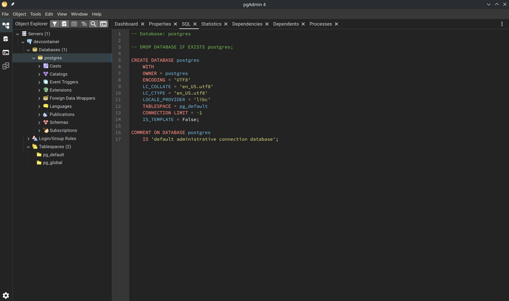

## Kafka

Kafka requires TLS on its internal, host-facing, and KRaft controller
listeners. A development CA and broker certificate are generated on the first
startup under `on-premises/docker/kafka-4/certificates/`; the private keys and
stores in that directory are ignored by Git.

The host listener is available at `localhost:9092`. Verify its certificate
with:

```shell
openssl s_client \
  -connect localhost:9092 \
  -servername localhost \
  -CAfile on-premises/docker/kafka-4/certificates/ca.crt \
  -verify_return_error </dev/null
```

The `jupyter-spark-4.1` image includes a TLS-enabled [`kafkactl`](https://github.com/deviceinsight/kafkactl) context for
the internal `kafka-4-backend:29092` listener. Kafka UI uses the same trusted CA and is
available through the [local services](#local-services) section.

```shell
docker compose -f on-premises/docker/docker-compose.yaml \
  exec jupyter-spark-4.1 \
  bash -lc 'eval "$($HOME/.local/bin/mise activate bash)" && kafkactl get topics'
```

## SSH tunnel

> [!NOTE]
> An SSH tunnel is not a full VPN, but it can be used in a similar way to
> securely access services on a private network from Databricks Free Edition
> or other Databricks environments.
>
> In [Databricks Free Edition](https://www.databricks.com/learn/free-edition),
> an [SSH tunnel](https://en.wikipedia.org/wiki/Tunneling_protocol) is the only
> available option for this type of private-network access.

```shell
ssh -p 9023 \
  -i ~/.ssh/id_ed25519_databricks_free \
  -o BatchMode=yes \
  -o StrictHostKeyChecking=accept-new \
  -o ControlMaster=auto \
  -o ControlPath=/tmp/ssh-databricks \
  -o ControlPersist=10m \
  -o UserKnownHostsFile=/tmp/known_hosts \
  tunnel@localhost
```

## AWS

### CLI

Install the AWS CLI on the host using
[mise](https://mise.jdx.dev/installing-mise.html), then log in with an AWS
account.

```shell
mise install aws-cli
```

Unset custom certificate-related environment variables, if necessary:

```shell
unset AWS_CA_BUNDLE
unset REQUESTS_CA_BUNDLE
unset SSL_CERT_FILE
```

List the configured AWS CLI profiles:

```shell
aws configure list-profiles
```

Log in as the `administrator` user on the host:

```shell
aws login --profile administrator
```

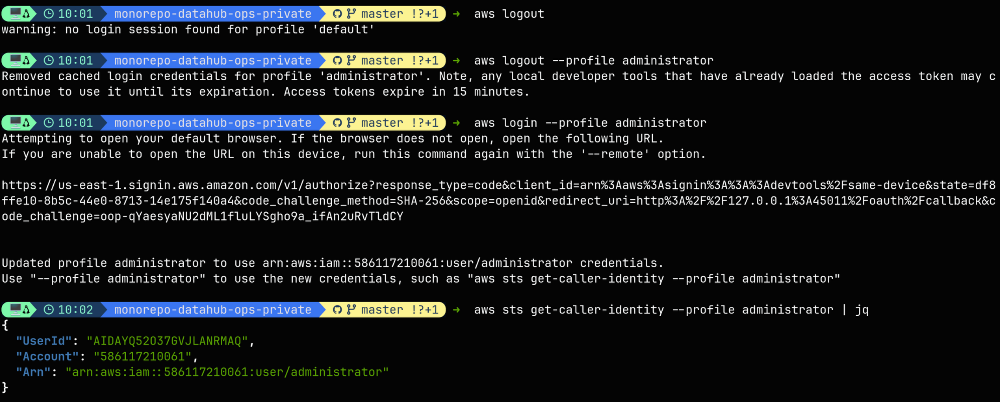

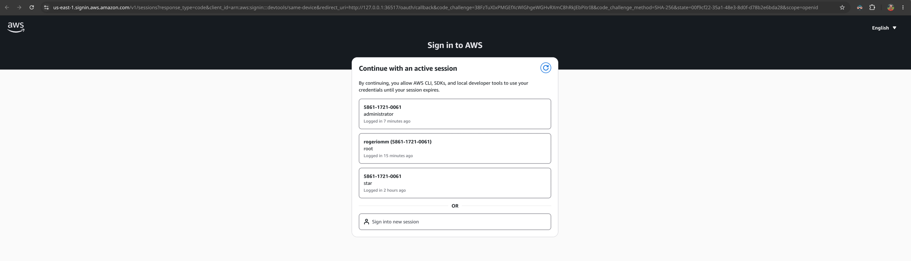

Verify the authenticated identity:

```shell
aws sts get-caller-identity --profile administrator | jq
```

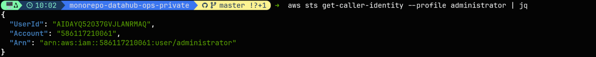

List the available S3 buckets:

```shell
aws s3 ls --profile administrator
```

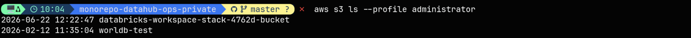

Start the development container:

```shell
devpod down .
devpod up . --ide none
ssh monorepo-datahub-ops-private.devpod
```

Inside the development container, unset the AWS environment variables that
override the selected profile:

```shell
unset AWS_ACCESS_KEY_ID AWS_CONFIG_FILE AWS_REGION AWS_SECRET_ACCESS_KEY AWS_SESSION_TOKEN AWS_CA_BUNDLE
```

Then verify the authenticated AWS identity:

```shell
aws sts get-caller-identity --profile administrator | jq
```

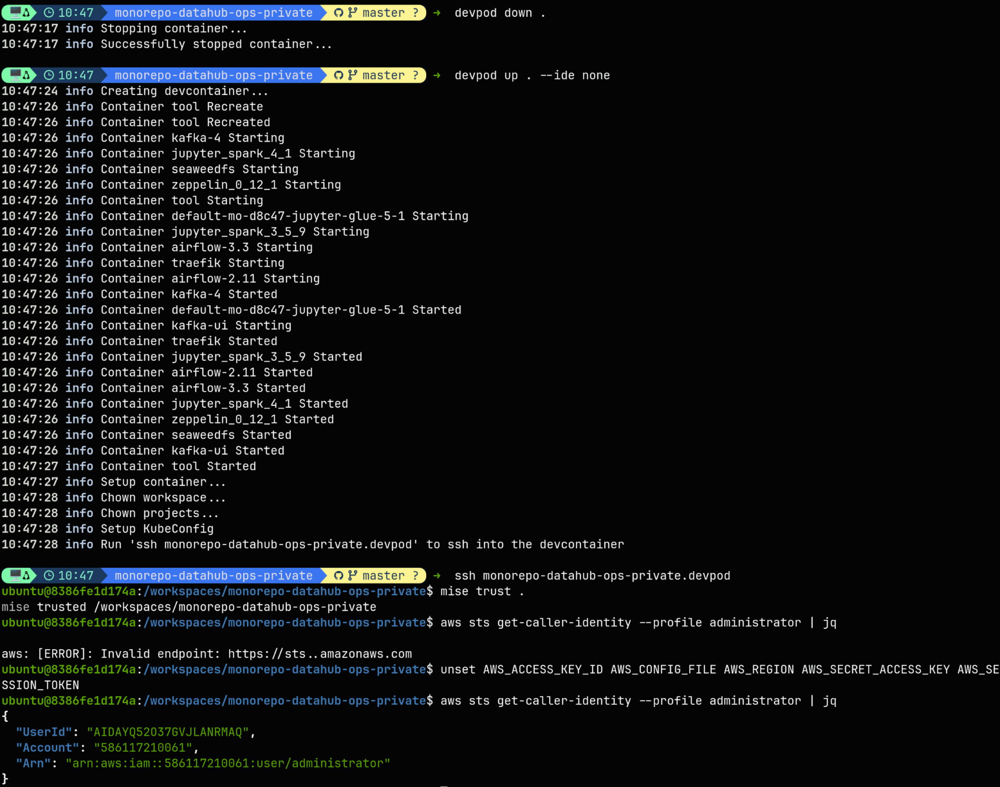

Using Visual Studio Code:


## Databricks

### CLI

- [Databricks CLI hello world notebook](../../notebooks/jupyter/databricks/free-edition/databricks-cli/databricks-cli-hello-world.ipynb)
- [Open the notebook in the local Jupyter service](http://jupyter-spark-4-1.localhost:8080/lab/tree/notebooks/jupyter/databricks/free-edition/databricks-cli/databricks-cli-hello-world.ipynb)

## Local services

- Reverse proxy
  - [Traefik administration interface](http://traefik.localhost:8080/dashboard/)
- Jupyter
  - [Spark 3.5](http://jupyter-spark-3-5.localhost:8080/lab)
  - [Spark 4.1](http://jupyter-spark-4-1.localhost:8080/lab)
  - [Spark 4.2](http://jupyter-spark-4-2.localhost:8080/lab)
- AWS Glue
  - [JupyterLab](http://jupyter-glue-5.localhost:8080/lab)
- Kafka
  - [Kafka UI](http://kafka-ui.localhost:8080)
- Zeppelin
  - [Zeppelin 0.12.1](http://zeppelin.localhost:8080)
- S3 object storage
  - [SeaweedFS master](http://seaweedfs-master.localhost:8080)
  - [SeaweedFS filer](http://seaweedfs-filer.localhost:8080)
  - [SeaweedFS S3](http://seaweedfs-s3.localhost:8080)
- Airflow
  - [Airflow 3.3](http://airflow-3-3.localhost:8080/)
  - [Airflow 2.11](http://airflow-2-11.localhost:8080/)
- Data presentation
  - [Superset](http://superset.localhost:8080/)
    - Default local credentials: `admin` / `admin`

## References

- [Video: My Entire Neovim + Tmux + Workflow (2026 Update)](https://youtu.be/fjoGZ90bOzw?t=2947)
  - [Video: Stateless Workstation](https://youtu.be/S6T5M4jLqR8?t=1410)
- [VS Code dev container with Zsh, Oh My Zsh, and the Agnoster theme](https://medium.com/@jamiekt/vscode-devcontainer-with-zsh-oh-my-zsh-and-agnoster-theme-8adf884ad9f6)
  - [My data engineering development setup — March 2022](https://medium.com/@jamiekt/my-dev-setup-march-2022-e89d21b19fe6)
- [Development Container JSON schema](https://github.com/devcontainers/spec/blob/main/schemas/devContainer.base.schema.json)
- [Development Container Dockerfile guide](https://containers.dev/guide/dockerfile)
- [Coder](https://github.com/coder/coder)
