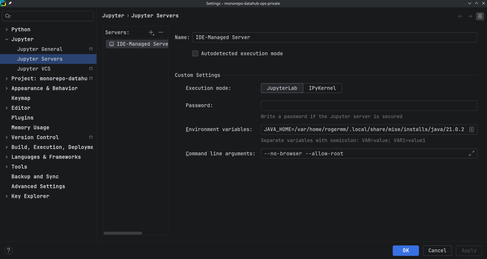
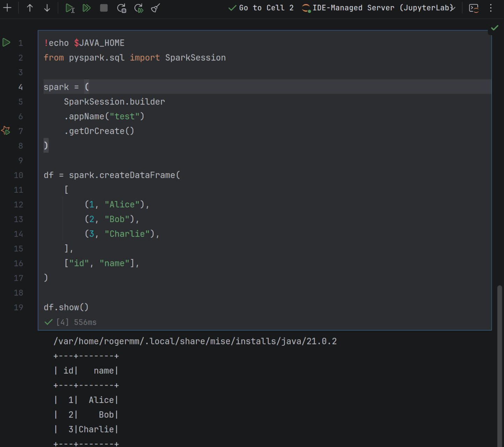
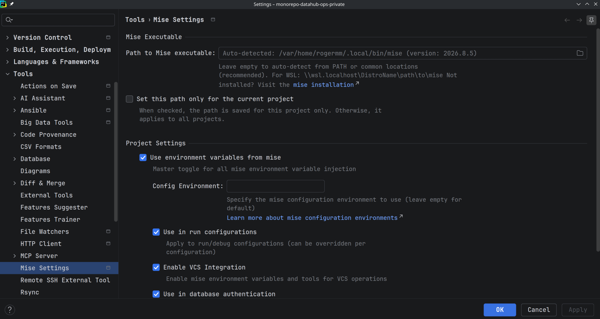
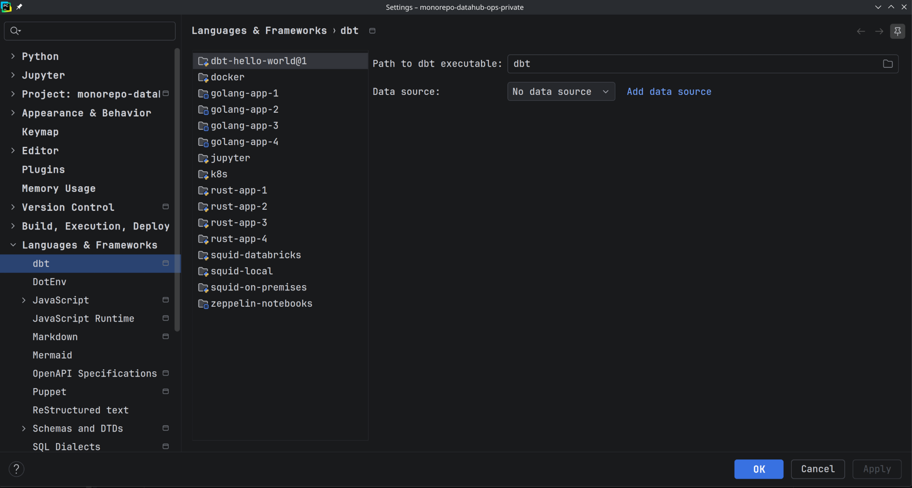

# JetBrains

## Kubernetes

- [JetBrains: Custom Resource Definitions support](https://www.jetbrains.com/help/go/2025.1/kubernetes.html?Kubernetes.crdSpecs&keymap=KDE&utm_source=product&utm_medium=link&utm_campaign=GO&utm_content=2025.1#crd)
  - [Argo CD custom resource definitions](https://github.com/argoproj/argo-cd/tree/master/manifests/crds)

## Jupyter notebooks

Locate the Java installation managed by `mise`:

```shell
mise where java
```

To print the Java home directory, run:

```shell
mise exec java -- sh -c 'java -XshowSettings:properties -version 2>&1 | grep "java.home"'
```


Set `JAVA_HOME` for the IDE-managed Jupyter server:



The configured Jupyter server can then run a PySpark notebook:



## Plugins

### mise plugin

Enable **Use environment variables from mise**. All packages installed with
`mise`, including Java, will then be available inside JetBrains IDEs.



### dbt plugin

Configure the path to the `dbt` executable for the project:


