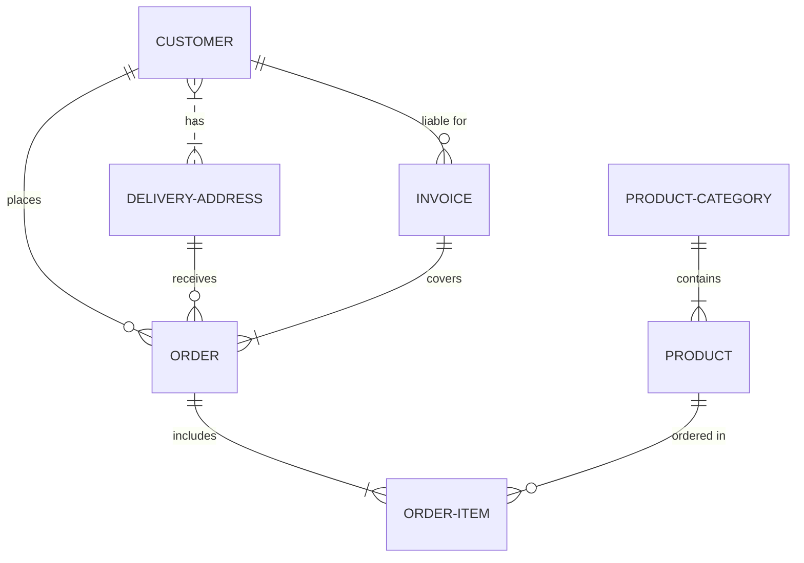
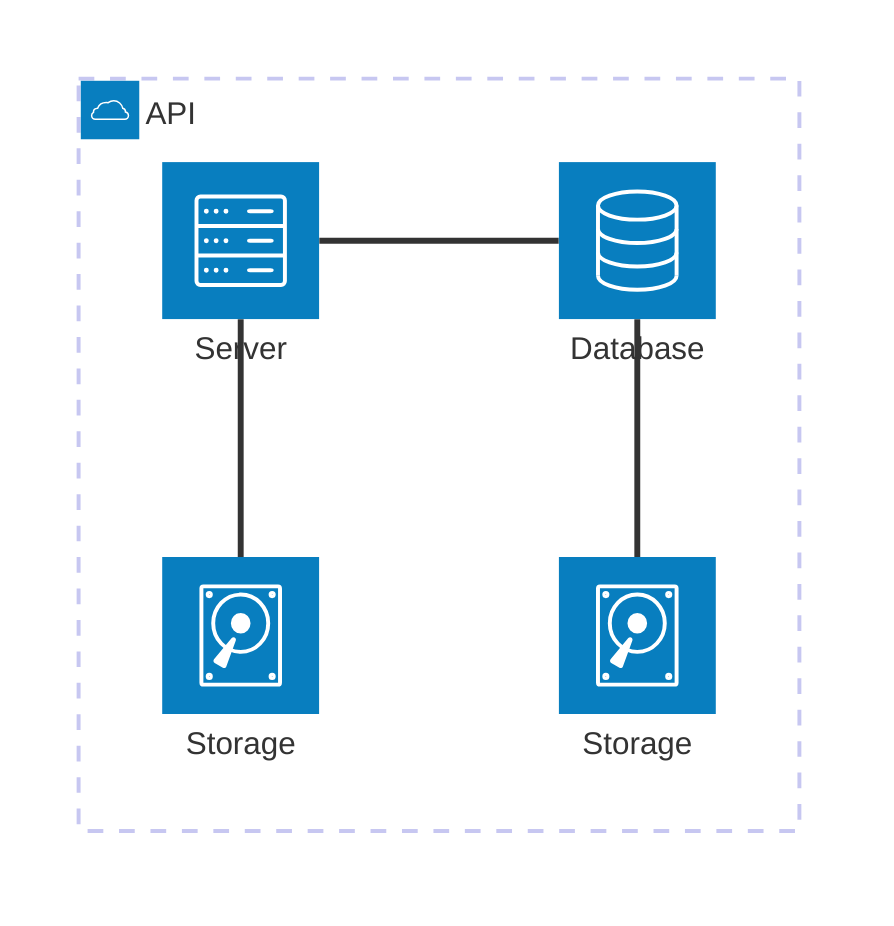
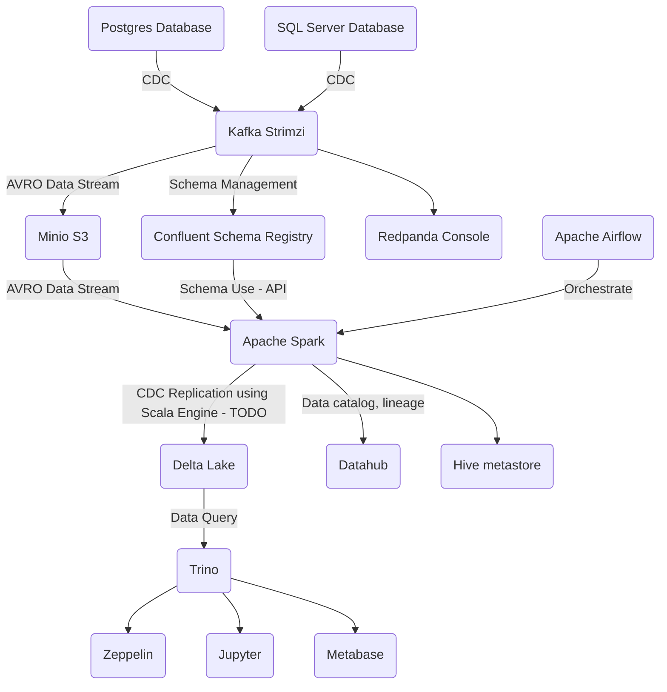

```mermaid
erDiagram
    CUSTOMER }|..|{ DELIVERY-ADDRESS : has
    CUSTOMER ||--o{ ORDER : places
    CUSTOMER ||--o{ INVOICE : "liable for"
    DELIVERY-ADDRESS ||--o{ ORDER : receives
    INVOICE ||--|{ ORDER : covers
    ORDER ||--|{ ORDER-ITEM : includes
    PRODUCT-CATEGORY ||--|{ PRODUCT : contains
    PRODUCT ||--o{ ORDER-ITEM : "ordered in"

```

```mermaid
architecture-beta
    group api(cloud)[API]

    service db(database)[Database] in api
    service disk1(disk)[Storage] in api
    service disk2(disk)[Storage] in api
    service server(server)[Server] in api

    db:L -- R:server
    disk1:T -- B:server
    disk2:T -- B:db
```

```mermaid
flowchart TD
    Postgres(Postgres Database) -->|CDC| Kafka(Kafka Strimzi)
    SQLServer(SQL Server Database) -->|CDC| Kafka
    Kafka -->|AVRO Data Stream| ConsumerMinio(Minio S3)
    ConsumerMinio -->|AVRO Data Stream| ConsumerSpark(Apache Spark)
    ConsumerSpark --> |CDC Replication using Scala Engine - TODO| ConsumerDelta(Delta Lake)
    ConsumerSpark --> |Data catalog, lineage| ConsumerDatahub(Datahub)
    ConsumerSpark --> HiveMetastore(Hive metastore)
    Kafka -->|Schema Management| SchemaRegistry(Confluent Schema Registry)
    Kafka --> RedpandaConsole(Redpanda Console)
    SchemaRegistry -->|Schema Use - API| ConsumerSpark
    ConsumerDelta -->|Data Query| Trino(Trino)
    click ConsumerDelta href "https://github.com/rogeriomm/debezium-cdc-replication-delta" "Visit GitHub repository"
    Airflow(Apache Airflow) -->|Orchestrate| ConsumerSpark
    Trino --> Zeppelin(Zeppelin)
    Trino --> Jupyter(Jupyter)
    Trino --> Metabase(Metabase)
    
    class Postgres,SQLServer database;
    class Kafka,SchemaRegistry kafka;
    class ConsumerMinio,ConsumerSpark,ConsumerDelta consumers;
    class Datahub datahub;
```
